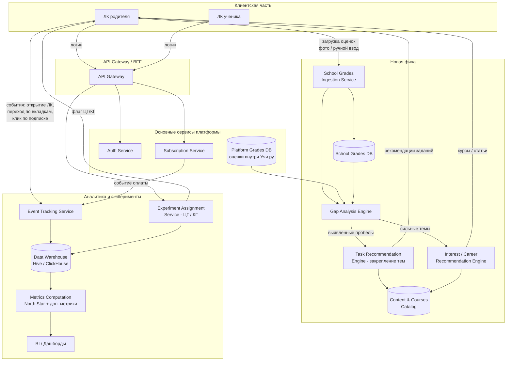

# LLD-диаграмма системы

Диаграмма нижнего уровня: сервисы, компоненты и потоки данных, необходимые для реализации фичи.

## Пояснение к компонентам

| Компонент | Назначение |
|---|---|
| **ЛК родителя** | Основной интерфейс: успеваемость, школьные оценки, пробелы, рекомендации, подписка |
| **API Gateway** | Единая точка входа, маршрутизация запросов, применение флага эксперимента (ЦГ/КГ) |
| **School Grades Ingestion Service** | Приём и валидация загруженных школьных оценок (ручной ввод/фото/интеграция с эл. дневником) |
| **Gap Analysis Engine** | Сопоставляет школьные и платформенные оценки, определяет проблемные и сильные темы |
| **Task Recommendation Engine** | Подбирает задания/материалы платформы под выявленные пробелы |
| **Interest/Career Recommendation Engine** | На основе сильных предметов предлагает курсы, статьи, профориентационный контент |
| **Event Tracking Service** | Логирует поведенческие события родителя в ЛК (сессии, вкладки, клики на подписку) |
| **Experiment Assignment Service** | Распределяет пользователей целевого сегмента на ЦГ/КГ и хранит назначение |
| **Metrics Computation** | Считает North Star и вспомогательные метрики с нужными срезами (подписка есть/нет, версия подписки) |
| **BI / Дашборды** | Визуализация метрик для оценки результатов эксперимента |

## Потенциальные точки роста
- Интеграция `School Grades Ingestion Service` с электронными дневниками школ (API), а не только ручной ввод — снижает шум в данных.
- `Interest/Career Recommendation Engine` в перспективе может стать ML-моделью (сейчас — правило-ориентированный слой поверх каталога контента).
