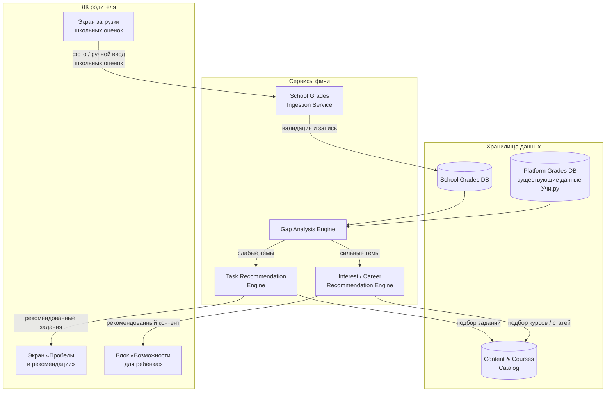
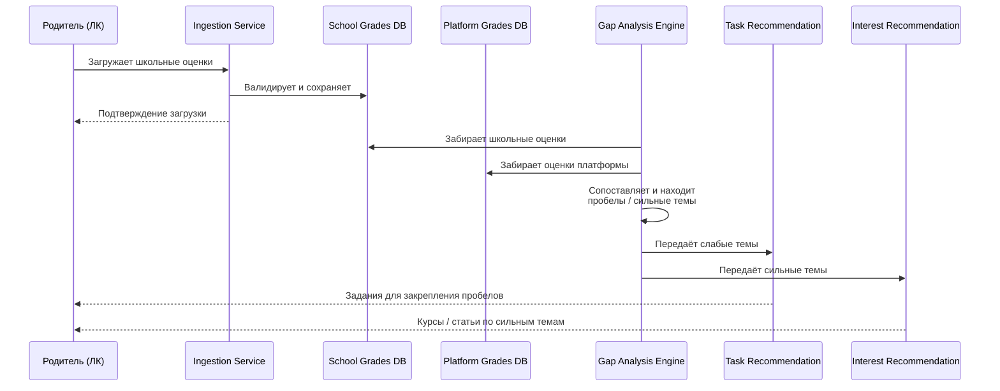

# LLD — новая фича в ЛК родителя

LLD описывает только архитектуру и процесс новой фичи (импорт школьных оценок → анализ пробелов → рекомендации), в разрезе ЛК родителя. Остальные роли и модули платформы (учитель, ученик, аутентификация, подписки, аналитика) не входят в этот процесс.

## Компонентная диаграмма и поток данных

## Процесс по шагам (sequence)

## Пояснение к компонентам

| Компонент | Назначение |
|---|---|
| **Экран загрузки школьных оценок** | Точка входа: родитель или ребёнок вносит реальные школьные оценки (фото дневника / ручной ввод) |
| **School Grades Ingestion Service** | Принимает, валидирует и нормализует загруженные оценки перед сохранением |
| **School Grades DB** | Хранилище школьных оценок, отдельное от оценок платформы |
| **Platform Grades DB** | Существующее хранилище результатов ребёнка внутри Учи.ру |
| **Gap Analysis Engine** | Сопоставляет школьные и платформенные оценки: находит темы, где ребёнок «просаживается» в школе, но платформа этого не видит, а также сильные темы |
| **Task Recommendation Engine** | По слабым темам подбирает конкретные задания/материалы платформы для закрепления |
| **Interest / Career Recommendation Engine** | По сильным темам подбирает внешний развивающий контент (курсы, статьи, профориентация) |
| **Content & Courses Catalog** | Справочник заданий платформы и внешнего контента, из которого берутся рекомендации |
| **Экран «Пробелы и рекомендации»** | Отображает родителю выявленные пробелы и предложенные задания |
| **Блок «Возможности для ребёнка»** | Отображает родителю рекомендации по сильным сторонам ребёнка |

## Точки роста
- `Ingestion Service` в будущем может получать оценки не только вручную, но и через интеграцию с электронным дневником школы (API).
- `Interest / Career Recommendation Engine` сейчас — правило-ориентированный слой поверх каталога контента, в перспективе может быть заменён на ML-модель.
